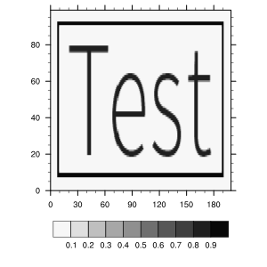
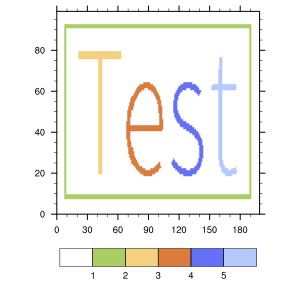

NCL feature detection
=====================

A simple feature detection algorithm written in FORTRAN with NCL wrapper.

Prerequisite | Version
-------------|------------------
gfortran     | >= 4.8
NCL          | tested with 6.3.0
fplus        | >= 0.1


## Compile

    make

make will automatically download the fplus preprocessor from https://github.com/r5r3/fplus

## Test case

    make test

The test uses the input file ```etc/test-1.nc```. The content is a two dimensional array containing the word "Test" and a border around this word. The background has the value ```0.0``` the word and the border have values around ```1.0```. 

Input data:



Output data:



## NCL API

At first, you have to load the external library:
    
    external LIBFEATURE "libfeature.so"

then you can call the procedure ```detect_features```:

    procedure detect_features(
        nx              : integer
        ny              : integer
        input_data  [2] : float
        output_data [2] : float
        threshold       : float
        fill_value      : float
        )

Arguments:

* ```nx, ny```: Dimensions of input and output data
* ```input_data```: The input data array, it is allowed to contain missing values
* ```output_data```: The output data array.
    * it contains missing values at points where the input array contains missing values
    * is zero at grid points without detected feature
    * is 1, 2, ... for grid points that belong to a feature (e.g. all grid points that belong to feature 2 the value 2 is returned)
* ```threshold```: grid points with larger values are considered to belong to a feature
* ```fill_value```: the ```@_FillValue``` used for input AND output data.

Have a look at the example!
